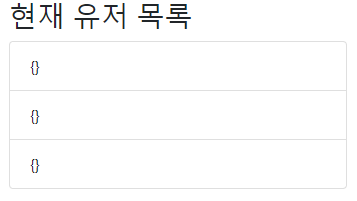

## 2024/07/02
이제 채팅은 구현이 완료했음.
`localhost`에 존재하는 redis를 사용해서 구현함.
이제 유저를 만들어서 해당 채팅방 내에 유저도 존재하게 구현해야함.
메세지도 해당 채팅방과 관계를 맺도록 설정하는 것도 생각해야할듯.
유저는 redis가 아니라 mysql에 저장하는 방식으로 진행할 생각임.
---
## 2024/07/03
### MySQL에 유저를 저장하다. 
일단 유저를 만들어서 해당 채팅방 내에 유저가 존재하게 했음.(정확히 말하면 유저가 존재하는건 아니고, 해당 `roomId`를 가진 유저를 출력하게 구현
하고 싶음) 일단 유저를 mysql에 저장하도록 하였음. 현재 문제점은
- 현재 유저 목록을 보았을 때 채팅방을 나갔다가 들어올 때 마다 목록이 증가해서 보임.

- 그리고 해당 `roomId`를 가지는 유저를 출력해야하는데 사진처럼 출력이 안됨. 실제로 mysql에서는 `roomId`가 저장이 되어 있기 때문에 잘 되야 한다고 생각하는데 좀 처럼 안되고 있음.
---
### 2024/07/04
### SockJS
SockJS은 내가 크롬 웹브라우저 상에서 채팅을 구현할 때 사용하는 것이었고, 실제 모바일 앱과 통신할 때는 필요가 없는 듯하다. 그래서 사용하지 않는게 나을 듯하다.
Websocket을 이용해서 구현하고자 하였다.
### ErrorHandler
소소하지만 에러를 관리하기 위해 `GloberExceptionHandler`를 구현했다. 아직 2개의 에러만 구현했고 기타 나머지도 구현을 하면 좋을듯.
### ListOperation
채팅 역시 redis에 저장하고 있는데, 내 생각에 채팅은 `HashOperation`으로 저장하면 채팅 내용이 보이지 않아 문제가 되는 것 같았다. 그래서 `ListOperation`으로 변경해보았다.

---
## 2024/07/06
### 채팅 로그를 구현하자.
- 채팅 메세지 자체를 저장하는 것보다 채팅 로그를 작성한 후, 이것을 저장하는게 합리적이라고 생각이 들었다. 그래서
redis를 캐시로 사용하고, minIO를 기본 DB로 사용해 볼 생각이다.
- redis를 캐시로 사용하기 위해 3일 동안만 데이터를 저장하게 설정하였다.
기본적인 자료 수집을 거쳐보았고, 이제 기존에 채팅 메세지가 아니라 채팅 로그를 저장하도록 service 단 코드를 수정해야 한다. 
- 채팅 로그를 저장한다면, 이를 다시 읽어와서 parsing 해서 채팅 메세지를 다시 채팅방에서 불러 읽을 수 있어야 한다.
이 기능을 구현해보도록 하자.
---
## 2024/07/18
### minio에 데이터를 저장하고, redis에서 먼저 데이터를 조회하자.
- 캐시 전략으로 `Look Aside + Write Around` 을 사용한다.
- 읽기 작업의 경우 캐시를 먼저 조회해서 있으면 캐시에서, 없으면 DB에서 읽기를 하고 캐시에 해당 값을 저장한다.
- 쓰기 작업의 경우에는 맨 처음에 무조건 DB에만 값을 저장하고, 후에 cache miss가 발생한 경우에만 캐시에 데이터를 저장한다.
- 이 기능을 구현해야 한다. Service 자체를 minioService와 ChatMessageService를 통합하는 방향으로 진행하면 좋을듯.
---
## 2024/07/19
### 채팅 저장이 안되는 부분을 수정하자.
- 현재 채팅 저장을 minio에 하고, 조회를 하는 경우 먼저 redis에서 하는 기능을 구현했다. 실제로 minio에 채팅이 전부 잘 저장되어 있는 것을 확인했다,.
- 하지만 생각해야 할 부분이 있는데
1. 채팅방을 따로 저장해야 하는가 -> 뭔가 추후 기능을 추가하면 저장해야 할듯
- 지금 채팅을 불러오면 첫번째 유저가 저장한 채팅은 모두 출력이 잘 되는데, 그 후 유저의 채팅이 저장이 안되고 있다. 이 부분을 수정해야 한다.
- pub/sub 관련 오류가 지금 발생하고 있는 듯 하다.
---
## 2024/07/21
### 채팅방은 redis에 저장하지 말자.
잠시 회상을 해보자. 지금 DB에 저장하려고 하니까 정작 채팅의 기능을 잃어버렸다.
처음에는 채팅의 기능을 완전히 구현했었음. 대신 나갔다가 들어오면 채팅이 없어지는 현상이 있었음
이를 해결하기 위해 DB를 도입하기로 함. 일단 간단하게 redis를 캐시가 아니라 DB로 사용했었음. 그랬더니 저장도 되고 잘 됐던거 같음.
그런데 실제로는 minio에서 저장을 해야함. 그래서 redis를 캐시로 사용하는 방식으로 진행을 했었음. 그런데 기능을 구현하다보니 pub/sub 기능을 잃어버린거 같음.
++ 기능은 회복했고, 일단 채팅만 redis에 저장하는 방식으로 진행하고 채팅방은 redis에 저장하지 않게 하였음.
---
## 2024/07/24
### 모델 구조를 바꾸자.
기존에는 회원, 채팅, 채팅방 3개의 구조로 진행해서 코드를 작성했고, 여기서 큰 탈은 없었음. 그런데 실무에서는 다대다 관계를 사용하지 않는다고 하는데 
현재 회원과 채팅방은 다대다 관계임. 그래서 이 구조를 수정하기 위해 중간 테이블 역할을 하는 UserChatRoom 객체를 추가해봤음. 물론 모델만 추가하고
추가적인 서비스에서 코드를 수정하지는 않았음. 일단 내가 의문이 드는 거는 2가지인데
1. 나는 redis(nosql)을 사용하는데도 다대다를 사용하면 안되는건지
2. 채팅방에 그냥 `List<Long> memberId` 이런 형식으로 저장해도 문제가 없는지... 나는 user의 경우 RDB에 넣을 예정인데 DB가 달라서 생기는 문제가 생길 수도 있겠다? 생각이 들긴하는데 정확하지는 않음. 문제가 없을거 같긴함.
### Spring Security, Stomp test
졸업 프로젝트에서 실시간 채팅을 구현하는데, 거기서는 Spring Security을 적용해서 jwt 인증을 사용했다. 그래서 웹소켓 연결을 하기 위해서는 'ws://localhost:8080/ws-stomp' 에 연결해야 하는데,
이 과정에서 인증이 되지 않아서 테스트가 되지 않았다. 그래서 SecurityConfig 파일도 만지고, WebSocketSecurityConfig 도 만들어서 실행해봤는데 여전히 연결조차 되지 않았다. 내 생각에는 '/ws-stomp' 로 오는
요청은 모두 허용하게 하면 쉽게 연결이 될거 같은데 연결이 되지 않았다. 그래서 일단 프론트엔드에서 채팅 부분을 구현할 때 까지 기다려 본 후 (?) 테스트 해보기로 하고 나는 다시 이 레포지토리로 와서
채팅 구조를 변경해보기로 하였다. 정말 많은 삽질을 해도 왜 안되는지 모르겠다. 다음에 다시 시도해봐야겠다.
